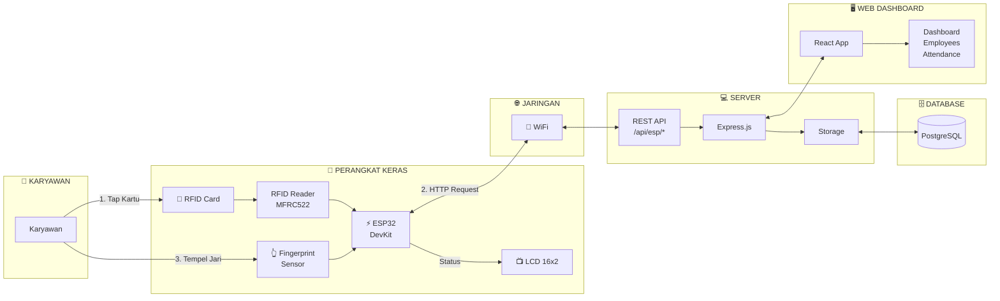
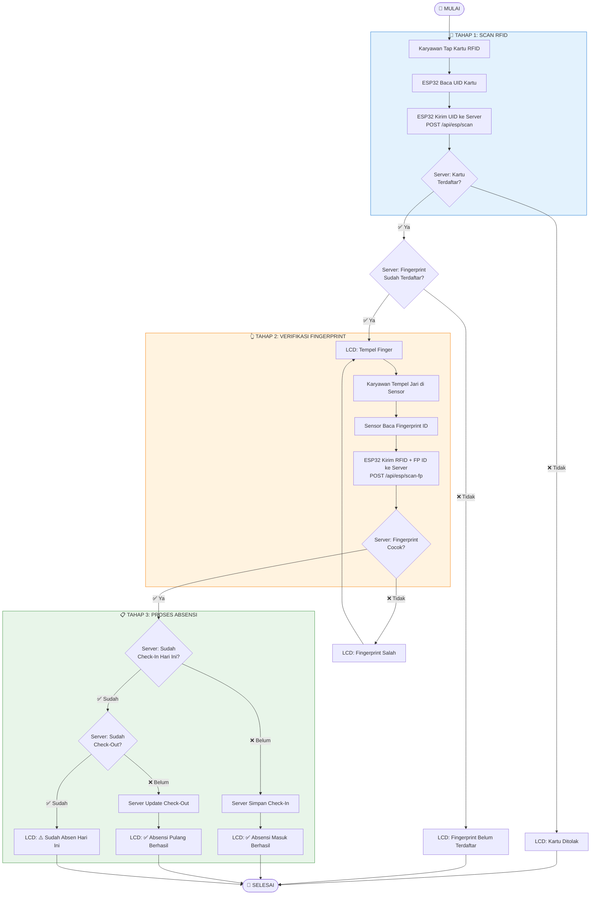

# Penjelasan Project: Sistem Absensi Karyawan Berbasis IoT

## 📋 Deskripsi Project

**Employee Presence System** adalah sistem absensi karyawan terintegrasi IoT yang menggunakan perangkat keras **ESP32** dengan sensor **RFID** dan **Fingerprint** untuk autentikasi dua faktor (2FA). Sistem ini menyediakan dashboard admin berbasis web untuk mengelola data karyawan dan melihat log absensi secara real-time.

### Fitur Utama

1. **Autentikasi 2FA (Two-Factor Authentication)**
   - Karyawan scan kartu RFID
   - Verifikasi dengan sidik jari (fingerprint)
   
2. **Dashboard Admin Web**
   - Manajemen data karyawan (CRUD)
   - Monitoring absensi harian
   - Riwayat absensi lengkap
   
3. **Integrasi Hardware IoT**
   - ESP32 DevKit sebagai mikrokontroler utama
   - MFRC522 RFID Reader
   - Sensor Fingerprint (Adafruit)
   - LCD I2C untuk display status

---

## 🏗️ Arsitektur Sistem

### Stack Teknologi

| Layer | Teknologi |
|-------|-----------|
| **Frontend** | React 18, TypeScript, TailwindCSS, shadcn/ui |
| **Backend** | Node.js, Express.js, TypeScript |
| **Database** | PostgreSQL + Drizzle ORM |
| **Hardware** | ESP32, RFID MFRC522, Fingerprint Sensor |
| **Komunikasi** | REST API (HTTP) |

---

## 📊 Block Diagram Sistem



---

## 📊 Flowchart Sistem Absensi (Check-In & Check-Out)

Sistem absensi menggunakan **autentikasi 2 faktor**: RFID + Fingerprint. Scan pertama dalam sehari = **Check-In**, scan kedua = **Check-Out**.



### Penjelasan Alur:

| Tahap | Aksi | Keterangan |
|-------|------|------------|
| **1** | Tap Kartu RFID | Karyawan menempelkan kartu RFID ke reader |
| **2** | Verifikasi Kartu | Server cek apakah kartu terdaftar di database |
| **3** | Scan Fingerprint | Karyawan diminta verifikasi sidik jari |
| **4** | Verifikasi Fingerprint | Server cek apakah fingerprint cocok dengan data karyawan |
| **5a** | **Check-In** | Jika belum absen hari ini → catat waktu masuk |
| **5b** | **Check-Out** | Jika sudah check-in tapi belum check-out → catat waktu pulang |

---

## 📁 Struktur Project

```
Employee-Presence/
├── client/                     # Frontend React
│   └── src/
│       ├── components/         # UI Components (shadcn/ui)
│       ├── pages/              # Halaman Route
│       │   ├── dashboard.tsx   # Dashboard utama
│       │   ├── employees.tsx   # Manajemen karyawan
│       │   └── attendance.tsx  # Log absensi
│       ├── hooks/              # Custom React Hooks
│       └── lib/                # Utilities
├── server/                     # Backend Express
│   ├── routes.ts               # API Route definitions
│   ├── storage.ts              # Data access layer
│   ├── index.ts                # Server entry point
│   └── static.ts               # Static file serving
├── shared/                     # Shared types & schemas
│   └── schema.ts               # Drizzle schema (Employee, Attendance)
├── RFID_Finger_Absensi/        # ESP32 Arduino Code
│   └── RFID_Finger_Absensi.ino # Firmware ESP32
└── package.json                # Dependencies
```

---

## 🔌 API Endpoints

### Employees
| Method | Endpoint | Deskripsi |
|--------|----------|-----------|
| GET | `/api/employees` | Get semua karyawan |
| GET | `/api/employees/:id` | Get karyawan by ID |
| POST | `/api/employees` | Tambah karyawan baru |
| PATCH | `/api/employees/:id` | Update data karyawan |
| DELETE | `/api/employees/:id` | Hapus karyawan |

### Attendance
| Method | Endpoint | Deskripsi |
|--------|----------|-----------|
| GET | `/api/attendance` | Get semua absensi |
| GET | `/api/attendance/today` | Get absensi hari ini |
| GET | `/api/attendance/recent` | Get 10 absensi terakhir |

### ESP32 Integration
| Method | Endpoint | Deskripsi |
|--------|----------|-----------|
| POST | `/api/esp/scan` | RFID scan (absensi/register) |
| POST | `/api/esp/scan-fp` | Fingerprint verification (2FA) |
| POST | `/api/esp/fp-enrolled` | Fingerprint enrollment |
| POST | `/api/esp/start-register` | Aktifkan mode register |
| GET | `/api/esp/pending-rfid` | Get pending RFID untuk form |
| DELETE | `/api/esp/pending-rfid` | Clear pending RFID |

---

## 🛢️ Model Data

### Employee
```typescript
{
  id: string,           // UUID
  name: string,         // Nama karyawan
  employeeId: string,   // NIP/NIK
  department: string,   // Departemen
  rfidId: string,       // ID Kartu RFID
  fingerprintId: number,// ID Fingerprint di sensor
  photoUrl: string      // URL foto (opsional)
}
```

### Attendance
```typescript
{
  id: string,           // UUID
  employeeId: string,   // Reference ke Employee
  checkIn: timestamp,   // Waktu check-in
  checkOut: timestamp,  // Waktu check-out
  date: string,         // Tanggal (YYYY-MM-DD)
  method: string        // "rfid+fingerprint"
}
```

---

## 🚀 Cara Menjalankan

### 1. Install Dependencies
```bash
npm install
```

### 2. Setup Database
```bash
npm run db:push
```

### 3. Jalankan Development Server
```bash
npm run dev
```

### 4. Upload Firmware ESP32
- Buka `RFID_Finger_Absensi/RFID_Finger_Absensi.ino` di Arduino IDE
- Sesuaikan WiFi SSID, Password, dan IP Server
- Upload ke ESP32

---

## 📝 Catatan Penting

1. **Koneksi WiFi**: ESP32 dan laptop/server harus berada di jaringan WiFi yang sama
2. **IP Address**: Sesuaikan `API_HOST` di kode ESP32 dengan IP laptop yang menjalankan server
3. **Port**: Default server berjalan di port 5000
4. **Database**: Sistem menggunakan in-memory storage by default, bisa diganti ke PostgreSQL untuk production
